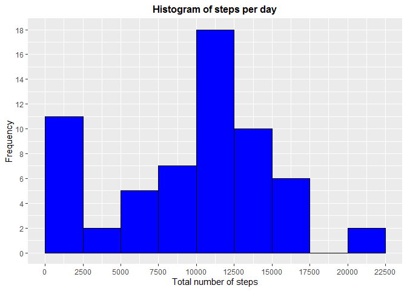
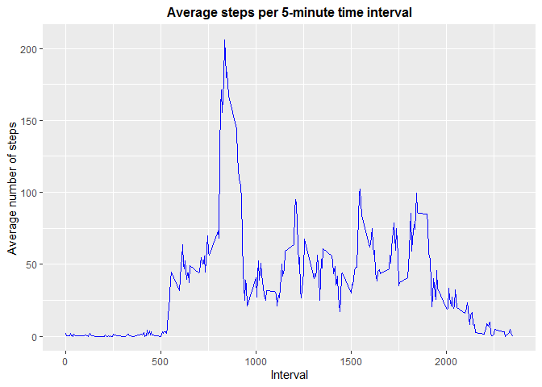
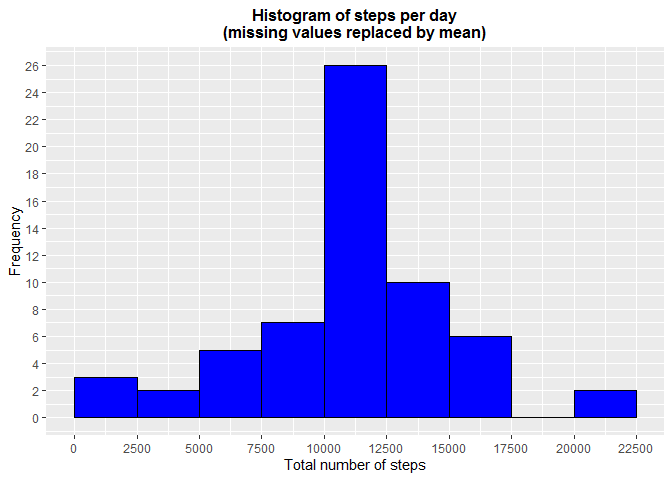
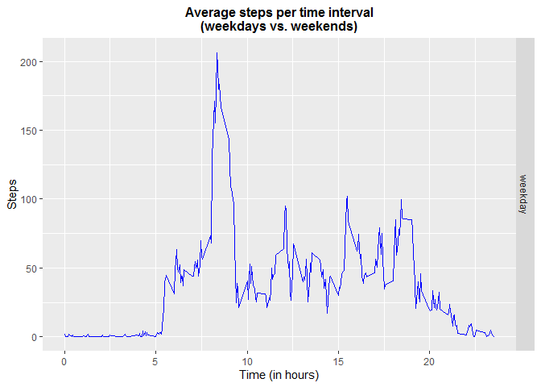

## Loading and preprocessing the data


```r
DataFile <- "data/activity.csv"
if (!file.exists(DataFile)) {
    tempFile <- tempfile()
    download.file("https://d396qusza40orc.cloudfront.net/repdata%2Fdata%2Factivity.zip", tempFile)
    unzip(tempFile, exdir = "data")
    unlink(tempFile)
}
Activity <- read.csv(DataFile, sep = ",")
Activity$date <- as.POSIXct(Activity$date, format = "%Y-%m-%d", tz = "")
head(Activity)
```

```
##   steps       date interval
## 1    NA 2012-10-01        0
## 2    NA 2012-10-01        5
## 3    NA 2012-10-01       10
## 4    NA 2012-10-01       15
## 5    NA 2012-10-01       20
## 6    NA 2012-10-01       25
```

## What is mean total number of steps taken per day?

Calculating steps per day (without missing values)


```r
stepsPerDay <- with(Activity, aggregate(steps, list(date), FUN = sum, na.rm = TRUE))
colnames(stepsPerDay) <- c("date", "steps")
head(stepsPerDay)
```

```
##         date steps
## 1 2012-10-01     0
## 2 2012-10-02   126
## 3 2012-10-03 11352
## 4 2012-10-04 12116
## 5 2012-10-05 13294
## 6 2012-10-06 15420
```

Display histogram


```r
library(ggplot2)
g <- ggplot(stepsPerDay, aes(stepsPerDay$steps))
g + geom_histogram(boundary = 0, binwidth = 2500, col = "black", fill = "blue") + ggtitle("Histogram of steps per day") + xlab("Total number of steps") + ylab("Frequency") + theme(plot.title = element_text(face = "bold", size = 12, hjust = 0.5)) + scale_x_continuous(breaks = seq(0, 25000, 2500)) + scale_y_continuous(breaks = seq(0, 18, 2))
```

```
## Warning: Use of `stepsPerDay$steps` is discouraged. Use `steps` instead.
```

<!-- -->

Mean and median number of steps taken each day

Mean (excluding missing values)


```r
mean(stepsPerDay$steps, na.rm = TRUE)
```

```
## [1] 9354.23
```

Median (excluding missing values)


```r
median(stepsPerDay$steps, na.rm = TRUE)
```

```
## [1] 10395
```

## What is the average daily activity pattern?

Calculating steps per time interval


```r
stepsPerIntervalAvg <- aggregate(steps ~ interval, data = Activity, FUN = mean, na.action = na.omit)
colnames(stepsPerIntervalAvg) <- c("interval", "steps")
```

A time series plot of the 5-minute interval (x-axis) and the average number of steps taken, averaged across all days (y-axis)


```r
g <- ggplot(stepsPerIntervalAvg, aes(stepsPerIntervalAvg$interval, stepsPerIntervalAvg$steps))
g + geom_line(col = "blue") + ggtitle("Average steps per 5-minute time interval") + xlab("Interval") + ylab("Average number of steps") + theme(plot.title = element_text(face = "bold", size = 12, hjust = 0.5))
```

```
## Warning: Use of `stepsPerIntervalAvg$interval` is discouraged. Use `interval`
## instead.
```

```
## Warning: Use of `stepsPerIntervalAvg$steps` is discouraged. Use `steps` instead.
```

<!-- -->

Which 5-minute interval, on average across all the days in the dataset, contains the maximum number of steps?


```r
library(dplyr)
```

```
## 
## Attaching package: 'dplyr'
```

```
## The following objects are masked from 'package:stats':
## 
##     filter, lag
```

```
## The following objects are masked from 'package:base':
## 
##     intersect, setdiff, setequal, union
```

```r
Activity %>% group_by(interval) %>%
    summarize(meanByInterval = mean(steps, na.rm = TRUE)) %>%
    filter(meanByInterval == max(meanByInterval))
```

```
## `summarise()` ungrouping output (override with `.groups` argument)
```

```
## # A tibble: 1 x 2
##   interval meanByInterval
##      <int>          <dbl>
## 1      835           206.
```

## Imputing missing values

There are a number of days/intervals where there are missing values (coded as
`NA`). The presence of missing days may introduce bias into some calculations or
summaries of the data.

Calculate and report the total number of missing values in the dataset (i.e. the
total number of rows with `NA`s)


```r
sum(is.na(Activity$steps) == TRUE)
```

```
## [1] 2304
```

Devise a strategy for filling in all of the missing values in the dataset. The
strategy does not need to be sophisticated. For example, you could use the
mean/median for that day, or the mean for that 5-minute interval, etc.

Strategy: Add a new column to the origin dataset named `stepsCompleted`
that replaces missing values with the rounded average of the 5-minute
interval.


```r
Activity$stepsCompleted <- ifelse(is.na(Activity$steps), round(stepsPerIntervalAvg$steps[match(Activity$interval, stepsPerIntervalAvg$interval)], 0), Activity$steps)
```

Create a new dataset that is equal to the original dataset but with the missing
data filled in.


```r
activityDataNoNA <- data.frame(steps = Activity$stepsCompleted, interval = Activity$interval, date = Activity$date)
head(activityDataNoNA, n = 10)
```

```
##    steps interval       date
## 1      2        0 2012-10-01
## 2      0        5 2012-10-01
## 3      0       10 2012-10-01
## 4      0       15 2012-10-01
## 5      0       20 2012-10-01
## 6      2       25 2012-10-01
## 7      1       30 2012-10-01
## 8      1       35 2012-10-01
## 9      0       40 2012-10-01
## 10     1       45 2012-10-01
```

Make a histogram of the total number of steps taken each day and calculate
and report the **mean** and **median** total number of steps taken per day.
Do these values differ from the estimates from the first part of the
assignment? What is the impact of imputing missing data on the estimates of
the total daily number of steps?


```r
stepsPerDayCompleted <- aggregate(activityDataNoNA$steps, list(activityDataNoNA$date), FUN = sum)
colnames(stepsPerDayCompleted) <- c("date", "steps")
g <- ggplot(stepsPerDayCompleted, aes(stepsPerDayCompleted$steps))
g + geom_histogram(boundary = 0, binwidth = 2500, col = "black", fill = "blue") + ggtitle("Histogram of steps per day\n(missing values replaced by mean)") + xlab("Total number of steps") + ylab("Frequency") + theme(plot.title = element_text(face = "bold", size = 12, hjust = 0.5)) + scale_x_continuous(breaks = seq(0, 25000, 2500)) + scale_y_continuous(breaks=seq(0, 26, 2))
```

```
## Warning: Use of `stepsPerDayCompleted$steps` is discouraged. Use `steps`
## instead.
```

<!-- -->

Calculate and report the mean and median total number of steps taken per day.

Mean


```r
mean(stepsPerDayCompleted$steps)
```

```
## [1] 10765.64
```

Median


```r
median(stepsPerDayCompleted$steps)
```

```
## [1] 10762
```

1. Do these values differ from the estimates from the first part of the assignment?

    They do differ, but not significantly when looking at the mean and the
    median of the total daily number of steps.

1. What is the impact of imputing missing data on the estimates of the total daily
   number of steps?

    Reviewing the histogram, the only two bins that were impacted are the
    intervals 0 - 2500 and
    10000 - 12500 steps; the latter of which grew from a frequency of 18 to a
    frequency of 26 (44%). Instead of replacing missing values with the mean,
    such as the mode or median, may have produced different results.

    <style>
      table.gridtable {
        font-family: verdana,arial,sans-serif;
        font-size:11px;
        color:#333333;
        border-width: 1px;
        border-color: #666666;
        border-collapse: collapse;
      }
      table.gridtable th {
        border-width: 1px;
        padding: 8px;
        border-style: solid;
        border-color: #666666;
        background-color: #dedede;
      }
      table.gridtable td {
        border-width: 1px;
        padding: 8px;
    	border-style: solid;
    	border-color: #666666;
    	background-color: #ffffff;
      }
    </style>
    <table class="gridtable">
      <tr>
      <th>Statistic</th>
      <th>Original Dataset</th>
      <th>Imputed Dataset</th>
      <th>Difference</th>
    </tr>
    <tr>
      <td>mean</td>
      <td align="right">9,354.23</td>
      <td align="right">10,765.64</td>
      <td align="right">1,411.41 (15%)</td>
    </tr>
    <tr>
      <td>median</td>
      <td align="right">10,395</td>
      <td align="right">10,762</td>
      <td align="right">367 (3%)</td>
    </tr>
    </table>

## Are there differences in activity patterns between weekdays and weekends?

For this part, the `weekdays()` function may be of some help here. Use the
dataset with the filled-in missing values for this part.

In this example, I created the following two factor variables:

* **weekDay**: indicate the day of the week (non-abbreviated)
* **dayType**: indicate whether the date is a weekday or a weekend

The current date variable in the dataset has already been formatted to represent
a date value using the `as.POSIXct()` function.


```r
# create a factor variable indicating the day of the week
weekDay <- weekdays(activityDataNoNA$date, abbreviate = FALSE)
activityDataNoNA <- cbind(activityDataNoNA, weekDay)
names(activityDataNoNA)[4] <- "weekDay"

# create a factor variable indicating weekday or weekend
dayType <- ifelse(activityDataNoNA$weekDay == 'Saturday' | activityDataNoNA$weekDay == 'Sunday', 'weekend', 'weekday')
activityDataNoNA <- cbind(activityDataNoNA, dayType)
names(activityDataNoNA)[5] <- "dayType"

# let's see the first 10 observations
head(activityDataNoNA, n = 10)
```

```
##    steps interval       date     weekDay dayType
## 1      2        0 2012-10-01 понедельник weekday
## 2      0        5 2012-10-01 понедельник weekday
## 3      0       10 2012-10-01 понедельник weekday
## 4      0       15 2012-10-01 понедельник weekday
## 5      0       20 2012-10-01 понедельник weekday
## 6      2       25 2012-10-01 понедельник weekday
## 7      1       30 2012-10-01 понедельник weekday
## 8      1       35 2012-10-01 понедельник weekday
## 9      0       40 2012-10-01 понедельник weekday
## 10     1       45 2012-10-01 понедельник weekday
```

Prepare data:

* create a data frame `stepsPerTime` that represents average steps per
  time interval by weekday/weekend
* add a `time` variable to display the time interval average in hours


```r
stepsPerTime <- aggregate(steps ~ interval + dayType, data = activityDataNoNA, FUN = mean, na.action = na.omit)
stepsPerTime$time <- stepsPerTime$interval/100
head(stepsPerTime, n = 10)
```

```
##    interval dayType      steps time
## 1         0 weekday 1.75409836 0.00
## 2         5 weekday 0.29508197 0.05
## 3        10 weekday 0.11475410 0.10
## 4        15 weekday 0.13114754 0.15
## 5        20 weekday 0.06557377 0.20
## 6        25 weekday 2.08196721 0.25
## 7        30 weekday 0.59016393 0.30
## 8        35 weekday 0.88524590 0.35
## 9        40 weekday 0.00000000 0.40
## 10       45 weekday 1.40983607 0.45
```

Make a panel plot containing a time series plot (i.e. `type="l"`) of the
5-minute interval (x-axis) and the average number of steps taken, averaged
across all weekday days or weekend days (y-axis).


```r
g <- ggplot(stepsPerTime, aes(time, steps))
g + geom_line(col = "blue") + ggtitle("Average steps per time interval\n(weekdays vs. weekends)") + xlab("Time (in hours)") + ylab("Steps") + theme(plot.title = element_text(face = "bold", size = 12, hjust = 0.5)) + facet_grid(dayType ~ .)
```

<!-- -->
